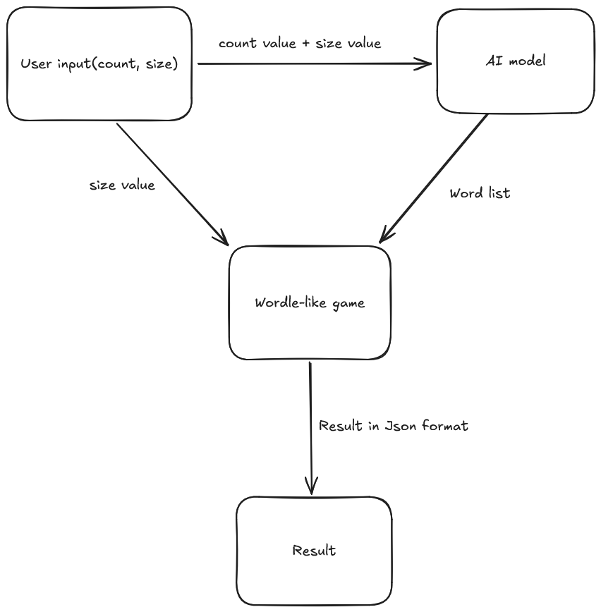
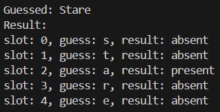

# Let's play a wordle-like puzzle
This program is designed to automatically guess random words. You can specify how many times you want to play the game and the number of letters for each word. The AI model will then generate a random word list for you. After that, the program will connect to the game using the API link and start the game automatically. The game will check each letter of the word to determine if it is absent, present, or correct. Good luck!

# flowchart

# Feature 
1. API link to the game: https://wordle.votee.dev:8000/random

2. AI model framework and model used: `Ollama` and `llama2`

# Getting Started
1. Installation
Make sure you have Python installed (version 3.6 or higher).

Install required packages using `pip install -r requirements.txt`.

2. Running the System:
Execute `main.py` to start the system.
Enter how many times that you want to play the game
Enter the letter size of each word

# Example Output
* `slot` is the position of a letter
* `guess` is the letter to guess
* `result` is the result which ranges from correct, present and absent

# Dependencies
* requests==2.32.3
* pydantic==2.10.4
* ollama==0.4.5

# References and Acknowledgments
Thanks for the contributions to the open-source community and those who make tutorials for them.

* [How to use Ollama Structured Outputs For Machine Learning Pipelines ](https://www.youtube.com/watch?v=zuXW0Hwpme4&list=LL&index=6&t=28s)

* [Ollama](https://ollama.com/)

* [Ollama-python](https://github.com/ollama/ollama-python)

* [llama3](https://ollama.com/library/llama3)

* [pydantic](https://docs.pydantic.dev/latest/)

